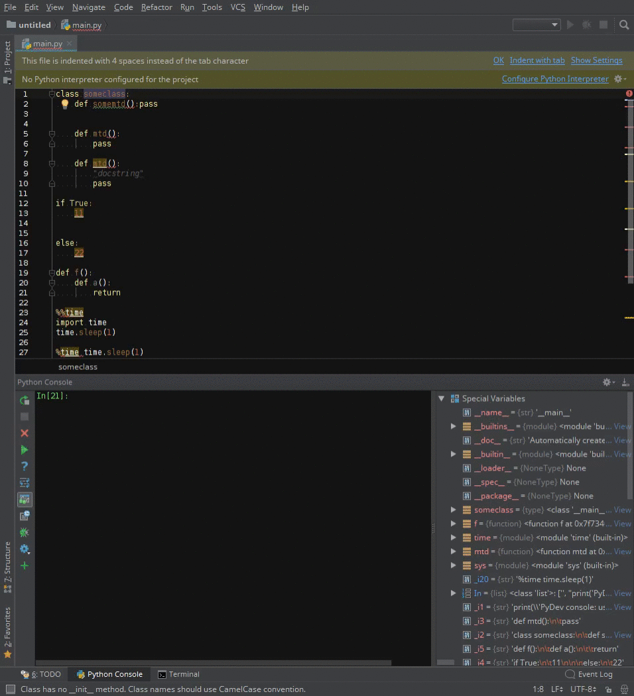

# Python Smart Execute

Python Smart Execute is a PyCharm [plugin](https://plugins.jetbrains.com/plugin/11945-python-smart-execute) for an alternative to “Execute Line in Console”.

It automatically determines the number of lines to be sent to the Python console.

keyboard shortcut: `alt` `shift` `A`. 

This is plugin implementation of the following PyCharm [pull request](https://github.com/JetBrains/intellij-community/pull/711). 

JetBrains feature request: https://youtrack.jetbrains.com/issue/PY-38919

When editing Python code, execute a top level code block with "Execute cell in console".

For IDEs with Jupyter notebook support, this executes a cell in the Python console.

keyboard shortcut: <code>alt shift E</code>.

